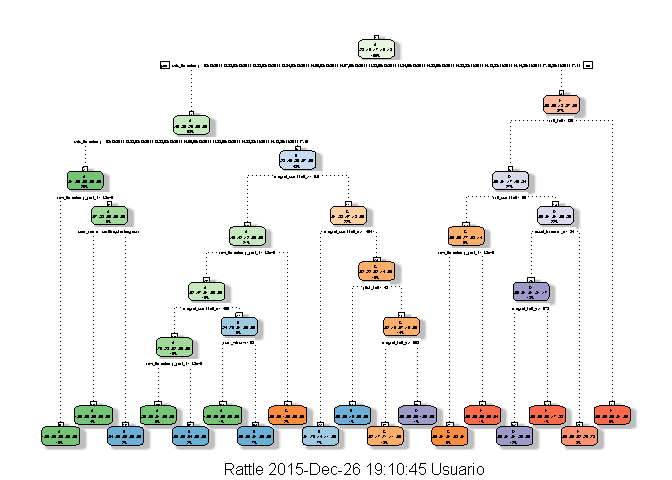

# Prediction Assignment Writeup - Practical Machine Learning Course Project

The objective of this project is to predict the manner in which 6 participants performed, correctly and incorrectly, barbell lifts in 5 different ways, using the data from the participant<92>s accelerometers on their belts, forearms, arms, and dumbbells.  The data consists of two sets: a training data set and a test data set.  The data for this project come from this source: <http://groupware.les.inf.puc-rio.br/har>.  The datasets are stored in comma-separated-value (CSV) files.

# Local Settings
Before all, we need to set C language local settings to default that reflects North-American usage:

```r
Sys.setlocale("LC_ALL", "C")
```

```
## [1] "C"
```

# Setting the Correct R Working Directory

```r
# setwd()
```

# Reproducibility
To ensure reproducibility, certain sets of package were installed, as well as setting a pseudo random variable.  Thus, for this project the following libraries were installed:

```r
library(caret)
```

```
## Loading required package: lattice
## Loading required package: ggplot2
```


```r
library(rpart)
library(rpart.plot)
library(RColorBrewer)
library(rattle)
```

```
## Rattle: A free graphical interface for data mining with R.
## VersiC3n 4.0.5 Copyright (c) 2006-2015 Togaware Pty Ltd.
## Escriba 'rattle()' para agitar, sacudir y  rotar sus datos.
```


```r
library(randomForest)
```

```
## randomForest 4.6-12
## Type rfNews() to see new features/changes/bug fixes.
```

Setting seed for research reproduceability:

```r
set.seed(12345)
```

# Downloading and Preprocessing the Data

## Data Loading
### Downloading the Training Data:

```r
trainUrl <-"https://d396qusza40orc.cloudfront.net/predmachlearn/pml-training.csv"
```
### Downloading the Testing Data:

```r
testUrl <- "https://d396qusza40orc.cloudfront.net/predmachlearn/pml-testing.csv"
```
### Loading Data Sets Solely to Memory

```r
training <- read.csv(url(trainUrl), na.strings=c("NA","#DIV/0!",""))
testing <- read.csv(url(testUrl), na.strings=c("NA","#DIV/0!",""))
```
### To Observe the Set's Number of Observations and Variables

```r
dim(training)
```

```
## [1] 19622   160
```

```r
dim(testing)
```

```
## [1]  20 160
```
From the previous, we can see that the training data set contains 19622 observations and 160 variables, and the testing data set contains 20 observations and 160 variables.  The <93>classe<94> variable, in the training data set, is the outcome to predict.

## Partioning the Training Data Set into Two
Partioning Training data set into two data sets, 60% for "training", 40% for "testing":

```r
inTrain <- createDataPartition(y=training$classe, p=0.6, list=FALSE)
myTraining <- training[inTrain, ]; myTesting <- training[-inTrain, ]
dim(myTraining); dim(myTesting)
```

```
## [1] 11776   160
```

```
## [1] 7846  160
```

# Data Cleaning
## 1st Transformation
For cleaning NearZeroVariance Variables, this code is ran to view possible NZV variables:

```r
myDataNZV <- nearZeroVar(myTraining, saveMetrics=TRUE)
```
Run this code to create another subset without NZV variables:

```r
myNZVvars <- names(myTraining) %in% c("new_window", "kurtosis_roll_belt", "kurtosis_picth_belt",
"kurtosis_yaw_belt", "skewness_roll_belt", "skewness_roll_belt.1", "skewness_yaw_belt",
"max_yaw_belt", "min_yaw_belt", "amplitude_yaw_belt", "avg_roll_arm", "stddev_roll_arm",
"var_roll_arm", "avg_pitch_arm", "stddev_pitch_arm", "var_pitch_arm", "avg_yaw_arm",
"stddev_yaw_arm", "var_yaw_arm", "kurtosis_roll_arm", "kurtosis_picth_arm",
"kurtosis_yaw_arm", "skewness_roll_arm", "skewness_pitch_arm", "skewness_yaw_arm",
"max_roll_arm", "min_roll_arm", "min_pitch_arm", "amplitude_roll_arm", "amplitude_pitch_arm",
"kurtosis_roll_dumbbell", "kurtosis_picth_dumbbell", "kurtosis_yaw_dumbbell", "skewness_roll_dumbbell",
"skewness_pitch_dumbbell", "skewness_yaw_dumbbell", "max_yaw_dumbbell", "min_yaw_dumbbell",
"amplitude_yaw_dumbbell", "kurtosis_roll_forearm", "kurtosis_picth_forearm", "kurtosis_yaw_forearm",
"skewness_roll_forearm", "skewness_pitch_forearm", "skewness_yaw_forearm", "max_roll_forearm",
"max_yaw_forearm", "min_roll_forearm", "min_yaw_forearm", "amplitude_roll_forearm",
"amplitude_yaw_forearm", "avg_roll_forearm", "stddev_roll_forearm", "var_roll_forearm",
"avg_pitch_forearm", "stddev_pitch_forearm", "var_pitch_forearm", "avg_yaw_forearm",
"stddev_yaw_forearm", "var_yaw_forearm")
myTraining <- myTraining[!myNZVvars]
#`To check the new number of observations
dim(myTraining)
```

```
## [1] 11776   100
```
## 2nd Transformation
Removing first column of dataset - ID Removing first ID variable so that it does not interfer with ML Algorithms:

```r
myTraining <- myTraining[c(-1)]
```
## 3rd Transformation
Variables that have more than a 60% threshold of NA<92>s are going to be left out:

```r
trainingV3 <- myTraining # creating another subset to iterate in loop
for(i in 1:length(myTraining)) { # for every column in the training dataset
        if( sum( is.na( myTraining[, i] ) ) /nrow(myTraining) >= .6 ) { # if numbers of NAs > 60% of total observations
        for(j in 1:length(trainingV3)) {
            if( length( grep(names(myTraining[i]), names(trainingV3)[j]) ) ==1)  { # if the columns are the same:
                trainingV3 <- trainingV3[ , -j] # remove that column
            }   
        } 
    }
}
# To check the new number of observations
dim(trainingV3)
```

```
## [1] 11776    58
```
Setting back to our set:

```r
myTraining <- trainingV3
rm(trainingV3)
```

The same previous 3 transformations are done on "myTesting"" and "testing"" data sets:

```r
clean1 <- colnames(myTraining)
clean2 <- colnames(myTraining[, -58]) # already with classe column removed
myTesting <- myTesting[clean1]
testing <- testing[clean2]

# To check the new number of observations
dim(myTesting)
```

```
## [1] 7846   58
```

To check the new number of observations:

```r
dim(testing)
```

```
## [1] 20 57
```

Note: The last column - problem_id - which is not equal to training sets, was also "automagically" removed so there was no need for this code:

```r
# testing <- testing[-length(testing)]
```

To ensure the proper functioning of Decision Trees, and particularly of the theRandomForest Algorithm with the Test data set (data set provided), the data has to be coerced into the same type:

```r
for (i in 1:length(testing) ) {
        for(j in 1:length(myTraining)) {
        if( length( grep(names(myTraining[i]), names(testing)[j]) ) ==1)  {
            class(testing[j]) <- class(myTraining[i])
        }      
    }      
}
# To corroborate that Coertion worked:
testing <- rbind(myTraining[2, -58] , testing) # note row 2 has no meaning, so it is removed:
testing <- testing[-1,]
```

# Using ML Algorithms for Making the Prediction: Decision Tree

```r
modFitA1 <- rpart(classe ~ ., data=myTraining, method="class")
```

## For viewing the decision tree

```r
fancyRpartPlot(modFitA1)
```

 

## Prediction

```r
predictionsA1 <- predict(modFitA1, myTesting, type = "class")
```

## To Test the Results We Use Confusion Matrix

```r
confusionMatrix(predictionsA1, myTesting$classe)
```

```
## Confusion Matrix and Statistics
## 
##           Reference
## Prediction    A    B    C    D    E
##          A 2150   60    7    1    0
##          B   61 1260   69   64    0
##          C   21  188 1269  143    4
##          D    0   10   14  857   78
##          E    0    0    9  221 1360
## 
## Overall Statistics
##                                           
##                Accuracy : 0.8789          
##                  95% CI : (0.8715, 0.8861)
##     No Information Rate : 0.2845          
##     P-Value [Acc > NIR] : < 2.2e-16       
##                                           
##                   Kappa : 0.8468          
##  Mcnemar's Test P-Value : NA              
## 
## Statistics by Class:
## 
##                      Class: A Class: B Class: C Class: D Class: E
## Sensitivity            0.9633   0.8300   0.9276   0.6664   0.9431
## Specificity            0.9879   0.9693   0.9450   0.9845   0.9641
## Pos Pred Value         0.9693   0.8666   0.7809   0.8936   0.8553
## Neg Pred Value         0.9854   0.9596   0.9841   0.9377   0.9869
## Prevalence             0.2845   0.1935   0.1744   0.1639   0.1838
## Detection Rate         0.2740   0.1606   0.1617   0.1092   0.1733
## Detection Prevalence   0.2827   0.1853   0.2071   0.1222   0.2027
## Balanced Accuracy      0.9756   0.8997   0.9363   0.8254   0.9536
```


```r
# Overall Statistics
#                                           
#                Accuracy : 0.8789          
#                  95% CI : (0.8715, 0.8861)
#     No Information Rate : 0.2845          
#     P-Value [Acc > NIR] : < 2.2e-16       
#                                           
#                   Kappa : 0.8468          
#  Mcnemar's Test P-Value : NA
```

# For Prediction, ML Algorithms are used: Random Forests

```r
modFitB1 <- randomForest(classe ~. , data=myTraining)
```

## Predicting In-sample Error

```r
predictionsB1 <- predict(modFitB1, myTesting, type = "class")
```

## Validating Results
Confusion Matrix is used to validate results:

```r
confusionMatrix(predictionsB1, myTesting$classe)
```

```
## Confusion Matrix and Statistics
## 
##           Reference
## Prediction    A    B    C    D    E
##          A 2231    2    0    0    0
##          B    1 1516    0    0    0
##          C    0    0 1366    3    0
##          D    0    0    2 1282    1
##          E    0    0    0    1 1441
## 
## Overall Statistics
##                                           
##                Accuracy : 0.9987          
##                  95% CI : (0.9977, 0.9994)
##     No Information Rate : 0.2845          
##     P-Value [Acc > NIR] : < 2.2e-16       
##                                           
##                   Kappa : 0.9984          
##  Mcnemar's Test P-Value : NA              
## 
## Statistics by Class:
## 
##                      Class: A Class: B Class: C Class: D Class: E
## Sensitivity            0.9996   0.9987   0.9985   0.9969   0.9993
## Specificity            0.9996   0.9998   0.9995   0.9995   0.9998
## Pos Pred Value         0.9991   0.9993   0.9978   0.9977   0.9993
## Neg Pred Value         0.9998   0.9997   0.9997   0.9994   0.9998
## Prevalence             0.2845   0.1935   0.1744   0.1639   0.1838
## Detection Rate         0.2843   0.1932   0.1741   0.1634   0.1837
## Detection Prevalence   0.2846   0.1933   0.1745   0.1638   0.1838
## Balanced Accuracy      0.9996   0.9993   0.9990   0.9982   0.9996
```


```r
# Overall Statistics
#                                           
#                Accuracy : 0.9987          
#                  95% CI : (0.9977, 0.9994)
#     No Information Rate : 0.2845          
#     P-Value [Acc > NIR] : < 2.2e-16       
#                                           
#                   Kappa : 0.9984          
#  Mcnemar's Test P-Value : NA  
```

**As expected, Random Forest yields more accurate results: an accuracy of 0.9987 vis-<e0>-vis an accuracy of 0.8789 in the original model.**

# Creating File Function for the Answers of the Prediction Assignment
Using the provided out-of-sample error test set, the following code is used for "Random Forests", which yielded a much better prediction in in-sample than for Decision Tree:

```r
predictionsB2 <- predict(modFitB1, testing, type = "class")
```

## Function to generate files for prediction assignment submission

```r
pml_write_files = function(x){
  n = length(x)
  for(i in 1:n){
    filename = paste0("problem_id_",i,".txt")
    write.table(x[i],file=filename,quote=FALSE,row.names=FALSE,col.names=FALSE)
  }
}

pml_write_files(predictionsB2)
```
